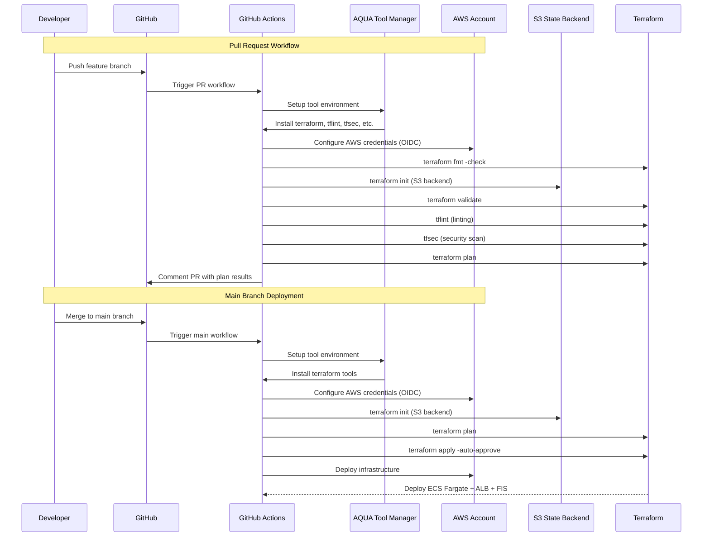

# 可用性試験検証環境

TerraformでECS on FargateアプリケーションとFIS実験環境を構築します。

## 構成

- **ECS Fargate**: 2つのタスクでNginxアプリケーションを実行
- **ALB**: パブリックサブネットでトラフィックを負荷分散
- **VPC**: 2つのAZにまたがるパブリック/プライベートサブネット
- **FIS**: ECSタスクの50%を停止する実験テンプレート

## ディレクトリ構造

```
.
├── main.tf                    # メイン設定とモジュール呼び出し
├── variables.tf              # 入力変数
├── outputs.tf               # 出力値
├── terraform.tfvars.example  # 変数例
├── modules/
│   ├── network/             # VPC、サブネット、セキュリティグループ
│   │   ├── main.tf
│   │   ├── variables.tf
│   │   └── outputs.tf
│   ├── alb/                 # Application Load Balancer
│   │   ├── main.tf
│   │   ├── variables.tf
│   │   └── outputs.tf
│   ├── ecs/                 # ECS Fargate サービス
│   │   ├── main.tf
│   │   ├── variables.tf
│   │   └── outputs.tf
│   └── fis/                 # AWS Fault Injection Simulator
│       ├── main.tf
│       ├── variables.tf
│       └── outputs.tf
└── backup/                  # バックアップファイル
```

## モジュール設計

### Network Module

- VPC、パブリック/プライベートサブネット
- インターネットゲートウェイ、NAT ゲートウェイ
- ルートテーブル

### ALB Module

- Application Load Balancer
- ターゲットグループ
- セキュリティグループ

### ECS Module

- ECS Fargate クラスター
- タスク定義とサービス
- IAM ロール
- CloudWatch ログ

### FIS Module

- 実験テンプレート
- IAM ロール
- CloudWatch ログ

## CI/CDワークフロー

AQUA（ツールマネージャ）とGitHub ActionsによるTerraform自動化を提供：



## デプロイ手順

### GitHub Actions使用

1. GitHub Secretsを設定:
   - `AWS_ROLE_ARN`: AssumeするIAMロールARN
   - `TF_STATE_BUCKET`: Terraform state S3バケット名
   - `TF_STATE_KEY`: state ファイルのS3キー

2. Pull Requestを作成してplanを確認

3. mainブランチにマージして自動デプロイ

### ローカル実行

1. terraform.tfvarsファイルを作成:
```bash
cp terraform.tfvars.example terraform.tfvars
```

2. Terraformを初期化:
```bash
terraform init
```

3. プランを確認:
```bash
terraform plan
```

4. リソースをデプロイ:
```bash
terraform apply
```

## FIS実験の実行

1. AWS コンソールでFISサービスにアクセス
2. `availability-test-test-stop-tasks-experiment` テンプレートを選択
3. 実験を開始してECSタスクが停止されることを確認
4. ALBが自動的に新しいタスクにトラフィックをルーティングすることを確認

## リソースの削除

```bash
terraform destroy
```
